# Masa Furniture Store

> Full-stack e-commerce platform — React 18 · Node.js/Express · SQLite 3 · Stripe · JWT Auth

**Course:** Getting Started in Web Programming (DLBITPEWP01\_E)  
**Student:** Frank Masabo
**Tutor:** Andrew Adjah Sai


**IU Internationale Hochschule**


---

## Figma Design

[](https://www.figma.com/proto/rnY2e00zdBpjpVmTj49K8Y/Masa---Furniture-by-Frank-Masabo--IU-Internationale-Hochschule?node-id=0-1&t=8zKYF7rOjVRu8RQN-1)

> Click the badge above to open the interactive Figma prototype in your browser.

---

## Live Demo
[View Live application](https://masa-furniture.onrender.com/)  

## Database Architecture


[View interactive diagram on dbdiagram.io](https://dbdiagram.io/d/69dfc56e0f7c9ef2c006ed90)

| Resource | Link |
|---|---|
| Live Application | https://masa-furniture.onrender.com|
| GitHub Repository | https://github.com/frankkode/Masa-Furniture |
| Demo — Admin | `admin@masa.com` / `Admin@123` |
| Demo — Client | `client@masa.com` / `Client@123` |
| Stripe Test Card | `4242 4242 4242 4242` · any future date · any CVC |

---

## Tech Stack

| Layer | Technology |
|---|---|
| Frontend | React 18, Vite, React Router v6, Axios |
| Styling | Bootstrap 5 + custom CSS variables |
| Payments | Stripe (`@stripe/react-stripe-js`) |
| Backend | Node.js 20 LTS, Express.js 4.x |
| Database | SQLite 3 + better-sqlite3 |
| Auth | JWT (jsonwebtoken) + bcrypt (12 rounds) |
| Email | Nodemailer (SMTP) |
| Testing | Jest 29 + Supertest (server) · React Testing Library (client) |
| CI/CD | GitHub Actions |

---

## Features

### Customer
- **Homepage** — Hero search, Best Selling Products with live category tabs, Testimonials carousel, Newsletter CTA
- **Shop** — Category sidebar with live counts, price-range filter, search, sort (5 options), grid/list toggle, pagination
- **Product Detail** — Image gallery, colour swatches, quantity stepper, Add to Cart, Reviews tab with star breakdown
- **Cart** — Qty controls, free-shipping progress bar, coupon input, order summary sidebar
- **Checkout** — 3-step wizard (Address → Review → Stripe Payment)
- **Order Confirmation** — Order ID, status badge, itemised receipt, delivery ETA
- **Auth** — Register with password-strength meter, login with show/hide, JWT session, protected routes
- **Dashboard** — Order history, wishlist management, profile & password settings, notifications

### Admin
- **Admin Dashboard** — Revenue stats, recent orders, low-stock alerts
- **Product Management** — Full CRUD with image upload
- **Order Management** — Status updates (pending → confirmed → shipped → delivered)
- **Shipping Settings** — Configurable rates

### Technical Highlights
- Server-side price integrity — cart stores no prices; `POST /api/orders` re-fetches from DB at checkout
- Stripe PaymentIntent amount set entirely server-side; client only calls `confirmCardPayment`
- Webhook handler for `payment_intent.succeeded` / `payment_intent.payment_failed`
- JWT 7-day expiry, bcrypt cost-factor 12 — plain-text passwords never stored
- React Context API for cart, auth, and wishlist state
- localStorage cart persistence — survives page refresh and browser back/forward navigation
- sessionStorage checkout persistence — survives refresh mid-wizard

---

## Architecture

### Figure 10 — Three-Tier System Architecture

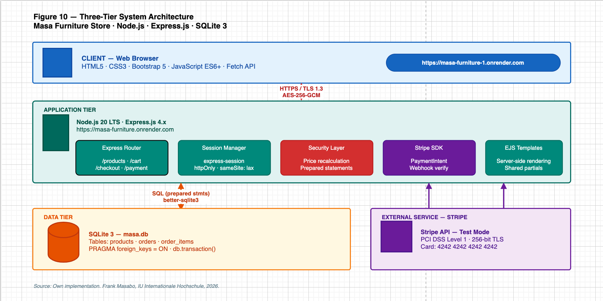

The React 18 SPA (Presentation) communicates with the Node.js/Express REST API (Application) over HTTPS/TLS 1.3 with JWT Bearer tokens. The API layer persists all data in SQLite 3 (Data) using synchronous prepared statements via `better-sqlite3`.

### Figure 7 — Entity Relationship Diagram

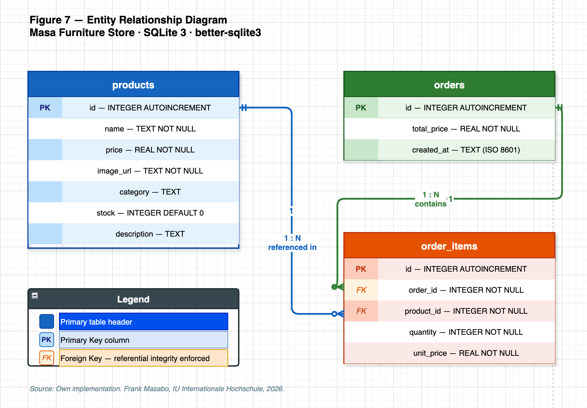

Core tables: `user`, `product`, `"order"`, `order_item`. Foreign key integrity enforced with `PRAGMA foreign_keys = ON`. The `order_item` junction table stores a price snapshot at purchase time, making order history immutable.

### Figure 11 — Security Architecture (Defence-in-Depth)

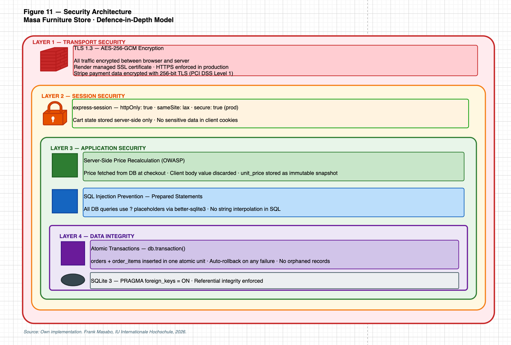

Four concentric security layers: Transport (TLS 1.3 / AES-256-GCM), Session (JWT httpOnly), Application (server-side price recalculation + prepared statements), and Data Integrity (atomic transactions + FK enforcement).

### Figure 12 — CI/CD Pipeline

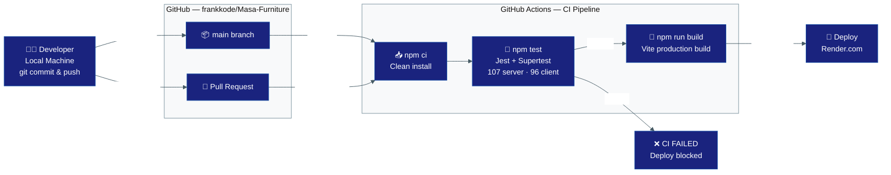

Every push to `main` runs: **Install → Test (107 server + 96 client) → Build → Deploy**. Any failure blocks the branch.

### Figure 14 — Responsive Breakpoints

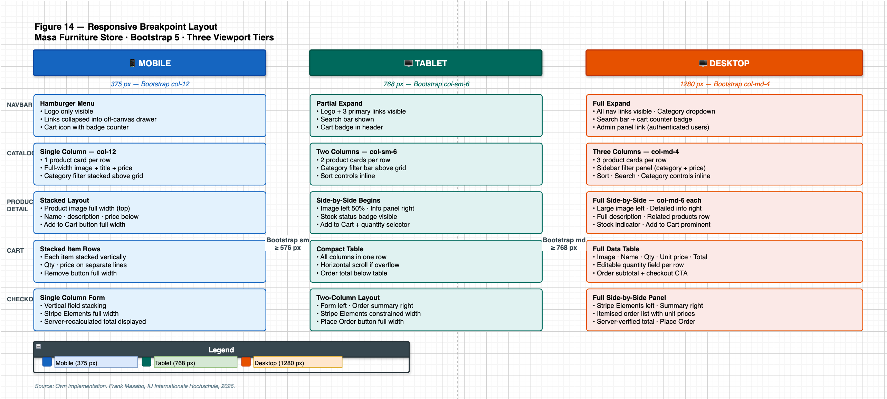

| Breakpoint | Width | Bootstrap Class | Grid |
|---|---|---|---|
| Mobile | < 576 px | `col-12` | 1 column |
| Tablet | 576–768 px | `col-sm-6` | 2 columns |
| Desktop | > 768 px | `col-md-4` | 3 columns |

---

## Test Results

### Server — 107 / 107 Passing


| Suite | Tests | Coverage |
|---|---|---|
| auth.test.js | 20 | Register, login, JWT issue, 401 on invalid token |
| orders.test.js | 18 | Price recalc, atomic insert, order history |
| reviews.test.js | 13 | Create, list, delete, rating breakdown |
| admin.test.js | 12 | 403 on non-admin, product CRUD, status update |
| admin_images.test.js | 10 | Image upload, reorder, delete |
| notifications.test.js | 11 | Create, mark-read, mark-all-read |
| contact.test.js | 8 | Nodemailer mock, validation |
| cart.test.js | 8 | Add, update qty, remove, clear |
| products.test.js | 7 | GET with filters, 404 on missing |
| **Total** | **107** | **9 suites — all passing** |

```bash
cd server && npm test
# Test Suites: 9 passed, 9 total
# Tests:      107 passed, 107 total
```

### Client — 96 / 96 Passing


```bash
cd client && npm test
# Test Files   12 passed (12)
# Tests        96 passed (96)
```

---

## Security

| Layer | Implementation |
|---|---|
| Transport | HTTPS / TLS 1.3 in production |
| Passwords | bcrypt 12 salt rounds — hash only, never plaintext |
| Authentication | JWT HS256, 7-day expiry, `requireAuth` on all protected routes |
| Authorisation | `requireAdmin` on all `/api/admin/*` routes — server-enforced (not just client-side) |
| Payments | PaymentIntent created server-side; status verified with Stripe API after client confirms |
| SQL | All queries via better-sqlite3 prepared statements — zero string interpolation |
| Transactions | `db.transaction()` for atomic order inserts — auto-rollback on any failure |

---

## Screenshots

### Homepage & Shop

| Desktop | Mobile |
|---|---|
|  |  |
| Hero banner with dark sofa scene | Mobile hero with search bar |

| Desktop | Mobile |
|---|---|
|  | 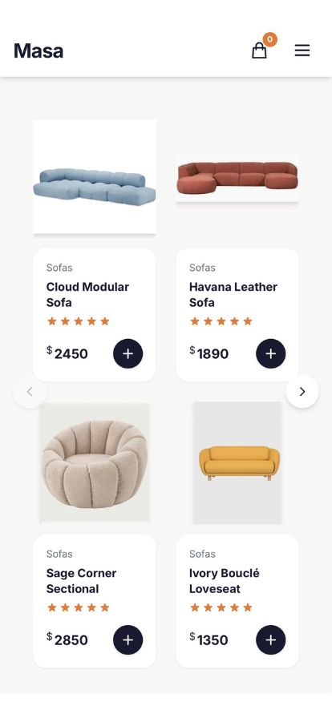 |
| Shop — 3-column grid, category tabs | 2-column mobile grid |

### Product Detail

| Desktop | Mobile |
|---|---|
| 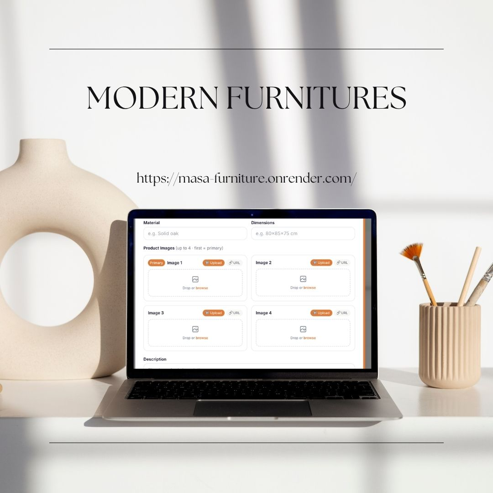 | 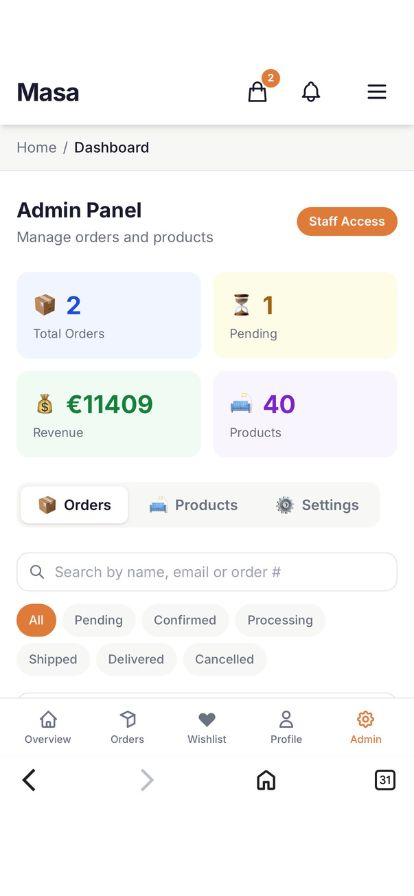 |
| Image gallery, reviews tab | Mobile product detail |

### Cart & Checkout

| Desktop | Mobile |
|---|---|
|  | 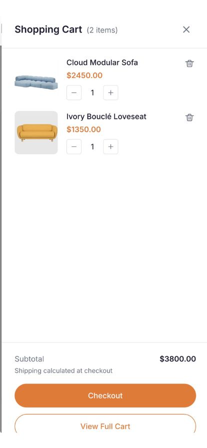 |
| Stripe Card Element — `4242 4242 4242 4242` | Mobile cart drawer |

| Desktop | Mobile |
|---|---|
| 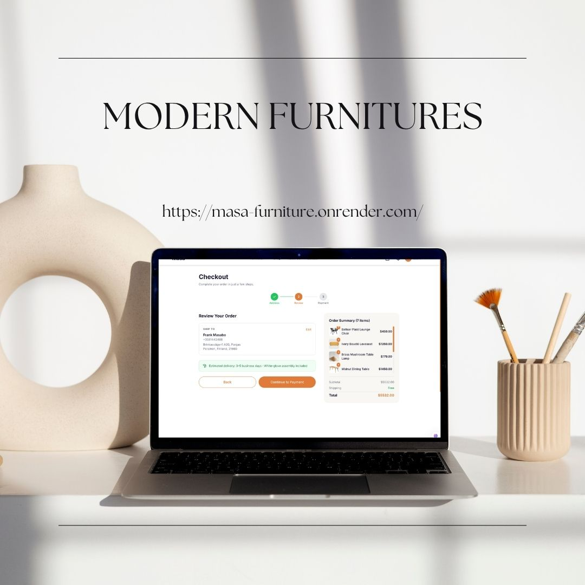 |  |
| Step 2 — Review before payment | Mobile checkout |

| Desktop | |
|---|---|
|  | |
| Order confirmed — itemised receipt | |

### Auth

| Mobile |
|---|
| 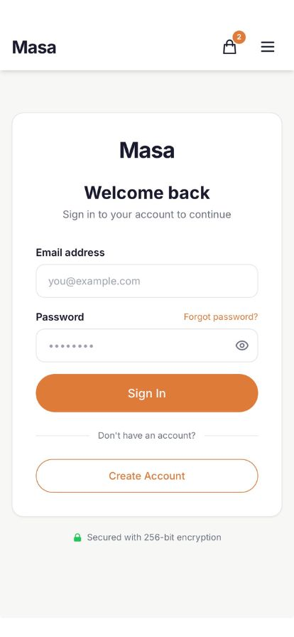 |
| Login — JWT session · 256-bit encryption badge |

### User Dashboard

| Desktop | Mobile |
|---|---|
|  | 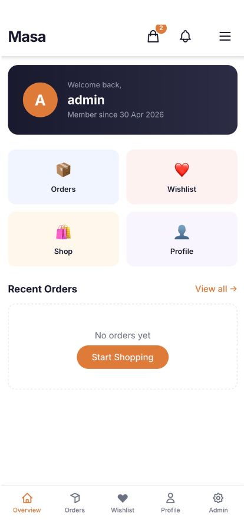 |
| Dashboard overview tiles | Mobile dashboard |

| Desktop | Mobile |
|---|---|
|  | 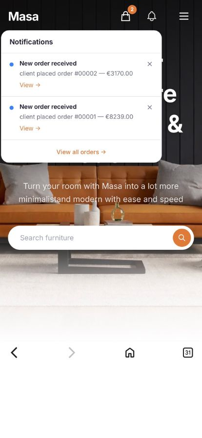 |
| Order history with status badges | Order notifications |

| Desktop | Mobile |
|---|---|
|  | 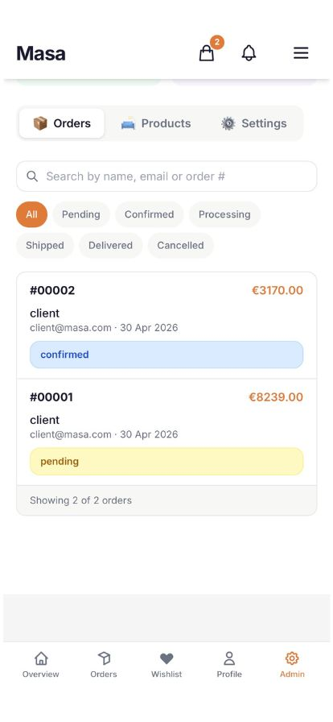 |
| Wishlist — saved items | Mobile order list |

| Desktop | |
|---|---|
|  | |
| Profile settings | |

### Admin Panel

| Desktop | Mobile |
|---|---|
|  | 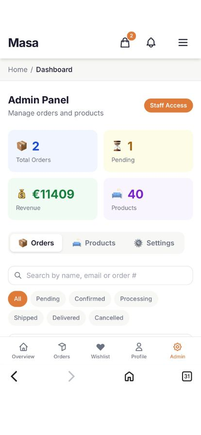 |
| Products — full CRUD with image upload | Mobile admin panel |

| Desktop | Mobile |
|---|---|
|  |  |
| Order management — status updates | Mobile order management |

| Desktop | |
|---|---|
|  | |
| Shipping settings — configurable rates | |

### Contact

| Desktop |
|---|
|  |
| Contact page with map — Nodemailer form |

---

## Getting Started

### Prerequisites
- Node.js 20+ · npm 9+

### Install & Run (Development)

```bash
git clone https://github.com/frankkode/Masa-Furniture.git
cd Masa-Furniture

# Server
cd server && npm install

# Client
cd ../client && npm install

# Run (two terminals)
cd server && npm run dev        # API → http://localhost:5000
cd client && npm run dev        # React → http://localhost:5173
```

### Run Tests

```bash
cd server && npm test           # 107 tests — Jest + Supertest
cd client && npm test           # 96 tests — React Testing Library
```

### Production

```bash
cd client && npm run build      # Builds to client/dist/
cd server && npm start          # Serves API + React build on port 5000
```

### Environment Variables

**`server/.env`**
```
JWT_SECRET=your_jwt_secret_here
STRIPE_SECRET_KEY=sk_test_...
STRIPE_WEBHOOK_SECRET=whsec_...
EMAIL_USER=your_email@gmail.com
EMAIL_PASS=your_app_password
CLIENT_URL=http://localhost:3000
```

**`client/.env`**
```
VITE_STRIPE_PK=pk_test_...
```

---

## API Reference

| Method | Route | Auth | Description |
|---|---|---|---|
| POST | `/api/auth/register` | — | Register, returns JWT |
| POST | `/api/auth/login` | — | Login, returns JWT |
| GET | `/api/products` | — | List (category, search, price, sort) |
| GET | `/api/products/:id` | — | Single product |
| POST | `/api/products` | Admin | Create product |
| PUT | `/api/products/:id` | Admin | Update product |
| DELETE | `/api/products/:id` | Admin | Delete product |
| GET | `/api/orders` | Auth | User's orders |
| POST | `/api/orders/create-payment-intent` | Auth | Create Stripe PaymentIntent |
| POST | `/api/orders` | Auth | Place order (verifies PI + recalculates total) |
| GET | `/api/admin/orders` | Admin | All orders |
| PUT | `/api/admin/orders/:id/status` | Admin | Update status |
| GET | `/api/wishlist` | Auth | User wishlist |
| POST | `/api/wishlist/:productId` | Auth | Add to wishlist |
| DELETE | `/api/wishlist/:productId` | Auth | Remove from wishlist |
| GET | `/api/users/profile` | Auth | Get profile |
| PUT | `/api/users/profile` | Auth | Update profile |
| GET | `/api/admin/shipping` | Admin | Get shipping config |
| PUT | `/api/admin/shipping` | Admin | Update shipping rates |
| POST | `/api/contact` | — | Contact form |
| POST | `/api/payments/webhook` | Stripe | Payment webhook |

---

## Project Structure

```
Masa-Furniture/
├── client/                    # React 18 SPA
│   ├── src/
│   │   ├── components/        # Navbar, Footer, ProductCard, CartDrawer…
│   │   ├── context/           # CartContext, AuthContext, WishlistContext
│   │   ├── pages/             # HomePage, ShopPage, CheckoutPage, Dashboard…
│   │   └── __tests__/         # React Testing Library suites
│   └── public/                # Static assets, product images
│
├── server/                    # Node.js + Express REST API
│   ├── src/
│   │   ├── routes/            # auth, products, orders, admin, wishlist, contact
│   │   ├── middleware/        # auth.js (requireAuth), upload.js
│   │   ├── db/                # schema.js, seed.js (40 products across 6 categories)
│   │   └── __tests__/         # Jest + Supertest suites
│   └── masa.db                # SQLite database
│
└── docs/
    ├── diagrams/              # draw.io XML source files
    └── screenshots/           # App screenshots and architecture diagrams
```

---

## Database Schema

```sql
-- PRAGMA settings applied at startup
PRAGMA foreign_keys = ON;
PRAGMA journal_mode = WAL;

CREATE TABLE user (
  id           INTEGER PRIMARY KEY AUTOINCREMENT,
  username     TEXT NOT NULL UNIQUE,
  email        TEXT NOT NULL UNIQUE,
  password     TEXT NOT NULL,           -- bcrypt hash, never plaintext
  is_staff     INTEGER DEFAULT 0,       -- 1 = admin
  is_superuser INTEGER DEFAULT 0,
  is_active    INTEGER DEFAULT 1,
  date_joined  DATETIME DEFAULT (datetime('now')),
  last_login   DATETIME
);

CREATE TABLE product (
  id          INTEGER PRIMARY KEY AUTOINCREMENT,
  name        TEXT NOT NULL,
  description TEXT,
  price       REAL NOT NULL,
  category_id INTEGER REFERENCES category(id),
  stock       INTEGER DEFAULT 0,
  created_at  DATETIME DEFAULT (datetime('now'))
);

CREATE TABLE "order" (
  id            INTEGER PRIMARY KEY AUTOINCREMENT,
  user_id       INTEGER REFERENCES user(id),
  total_price   REAL NOT NULL,           -- always server-calculated
  shipping_cost REAL DEFAULT 0,
  status        TEXT DEFAULT 'pending',
  stripe_pi     TEXT,                    -- Stripe PaymentIntent ID
  created_at    DATETIME DEFAULT (datetime('now'))
);

CREATE TABLE order_item (
  id         INTEGER PRIMARY KEY AUTOINCREMENT,
  order_id   INTEGER REFERENCES "order"(id),
  product_id INTEGER REFERENCES product(id),
  quantity   INTEGER NOT NULL,
  price      REAL NOT NULL               -- price snapshot, immutable after insert
);
```
---

## License

Built for academic submission — IU Internationale Hochschule, 2026.  
© Frank Masabo
